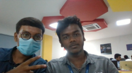
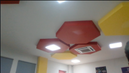
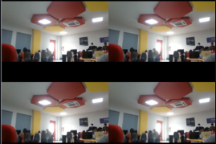
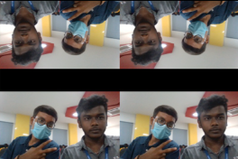

<H1 align="center">Image Acquisition from Web Camera</h1>

## Aim:
To write a python program using OpenCV to capture the image from the web camera and do the following image manipulations.
<br>
i) Write the frame as JPG 
<br>
ii) Display the video 
<br>
iii) Display the video by resizing the window.
<br>
iv) Rotate and display the video

## Software Used:
Anaconda - Python 3.7
## Algorithm:
### Step 1:
Import Opencv and numpy(selective programs).
### Step 2:
Using VideoCapture(0), you can capture the picture.
### Step 3:
Using read(),you can read the given inpiut through webcam.
### Step 4:
Using get() or shape() we can divide the screens into many parts.
### Step 5:
End the Program.

## Program:
```
Developed By:Sai Darshan
Register No:212221240047
i) Write the frame as JPG file
import cv2
Capture=cv2.VideoCapture(0)
while(True):
    R,Frame=Capture.read()
    cv2.imwrite("Current Pic.jpg",Frame)
    result=False
    if cv2.waitkey(1)==ord('q'):
        break
Capture.release()q
cv2.destroyAllWindows()

ii) Display the video
import cv2
Capture=cv2.VideoCapture(0)
while(True):
    R,Frame=Capture.read()
    cv2.imshow("Frame",Frame)
    if cv2.waitKey(1)==ord('q'):
        break
Capture.release()
cv2.destroyAllWindows()

iii) Display the video by resizing the window
import numpy as np
import cv2
Capture=cv2.VideoCapture(0)
while(True):
    R,Frame=Capture.read()
    Width=int(Capture.get(3))
    Height=int(Capture.get(4))
    image=np.zeros(Frame.shape,np.uint8)
    smaller_frame=cv2.resize(Frame, (0,0), fx=0.5, fy=0.5)
    image[:Height//2,:Width//2]=smaller_frame
    image[Height//2:,:Width//2]=smaller_frame
    image[:Height//2,Width//2:]=smaller_frame
    image[Height//2:,Width//2:]=smaller_frame
    cv2.imshow("Frame",image)
    if cv2.waitKey(1)==ord('q'):
        break
Capture.release()
cv2.destroyAllWindows()

iv) Rotate and display the video
import numpy as np
import cv2
Capture=cv2.VideoCapture(0)
while(True):
    R,Frame=Capture.read()
    Width=int(Capture.get(3))
    Height=int(Capture.get(4))
    image=np.zeros(Frame.shape,np.uint8)
    smaller_frame=cv2.resize(Frame, (0,0), fx=0.5, fy=0.5)
    image[:Height//2,:Width//2]=smaller_frame
    image[Height//2:,:Width//2]=cv2.rotate(smaller_frame,cv2.ROTATE_180)
    image[:Height//2,Width//2:]=smaller_frame
    image[Height//2:,Width//2:]=cv2.rotate(smaller_frame,cv2.ROTATE_180)
    cv2.imshow("Frame",image)
    if cv2.waitKey(1)==ord('q'):
        break
Capture.release()
cv2.destroyAllWindows()
```
## Output:
### i) Write the frame as JPG image

### ii) Display the video

### iii) Display the video by resizing the window

### iv) Rotate and display the video


## Result:
Thus the image is accessed from webcamera and displayed using openCV.
